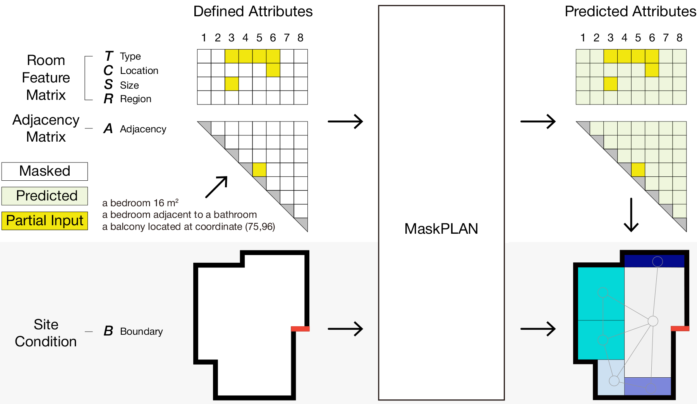

# MaskPLAN
**[MaskPLAN: Masked Generative Layout Planning from Partial Input](https://openaccess.thecvf.com/content/CVPR2024/html/Zhang_MaskPLAN_Masked_Generative_Layout_Planning_from_Partial_Input_CVPR_2024_paper.html)**

*Hang Zhang, Anton Savov, Benjamin Dillenburger*

*Digital Building Technologies, ETH Zurich*



MaskPLAN allows users to influence layout generation with just the features they prioritize, using partial inputs in a Graph-structured Dynamic Masked Autoencoder (GDMAE), predicting layouts from incomplete design ideas.

**Video:**
<!-- [Paper Link](https://openaccess.thecvf.com/content/CVPR2024/html/Zhang_MaskPLAN_Masked_Generative_Layout_Planning_from_Partial_Input_CVPR_2024_paper.html)

[Video Link](https://www.youtube.com/watch?v=HuzoJdMWnRM) -->


[](https://www.youtube.com/watch?v=HuzoJdMWnRM)

## Installation
 
**1. install the requirements:**

Clone the repo and install conda env:
```
cd MaskPLAN
conda env create -f MaskPLAN.yaml
conda activate MaskPLAN
```

The released environment was tested on Windows 10 with an NVIDIA RTX 4090. We
recommend Windows for reproducing the released inference setup; Linux has not
been validated and may encounter conda dependency-version mismatches. On
Windows, a few pip dependencies may still need to be installed manually if
conda does not resolve them on a particular machine. `MaskPLAN.yaml` does not
contain a machine-specific conda `prefix`; remove or adjust that line if using
an older copy of the file.

System requirements:
- a. GPU with at least 24GB Memory.
- b. System RAM at least 32GB.
- c. Hard-drive free storage at least 20GB.

**2. prepare the dataset:**

The original RPLAN dataset is from [RPLAN project page](http://staff.ustc.edu.cn/~fuxm/projects/DeepLayout/index.html). Our data preprocess inherited the implementation from [RPLAN-Toolbox](https://github.com/zzilch/RPLAN-Toolbox) and [Graph2Plan-DataPreparation](https://github.com/HanHan55/Graph2plan/tree/master/DataPreparation). We've offered the pre-processed data in folder `Processed_data`. If you would like to walk through our data processing, follow the steps:

- a. download the dataset from this [link](https://docs.google.com/forms/d/e/1FAIpQLSfwteilXzURRKDI5QopWCyOGkeb_CFFbRwtQ0SOPhEg0KGSfw/viewform), put in [your_downloaded_path]. run through the *RPLAN_DataProcess.ipynb* in folder `Processed_data`, where the dataset path should follow [your_downloaded_path].

- b. pretraining the vqvae by run through the *VQVAE_Prior_Training_5564_B.ipynb* and *VQVAE_Prior_Training_5564_R.ipynb* in folder `VQVAE_Pretrain`. We've also offered our checkpoints, see folder `VQ_Pretrained`.

- c. run dynamic masking data processing in folder `Processed_data`. We offer the process of vector-only attributes representation (as ablation), and the img-vec hybrid attributes representation (as in our paper).

```
# data in vector-only format
python Processed_data/FP_DataProcess_vec.py

# data in vec-img hybrid format
python Processed_data/FP_DataProcess_cross.py
```

For inference, the boundary images produced by step (a) are required. As an
alternative, extract `parsed_img/img_room_sqe/0.7z` so that files such as
`parsed_img/img_room_sqe/0/<site_id>.png` exist. Steps (b) and (c) may be
skipped when using the released pretrained and preprocessed artifacts.

## training

We've offered our checkpoints in this [link](https://drive.google.com/drive/folders/1yvKe9l3l3zk7nM36LqgWmeeBIZTck0kp?usp=sharing) with four ablations (two model sizes with vector-only or vec-img hybrid data). If you would like to train the model, run the following code:

```
# training small mdoel in vector-only format
python Train/MaskPLAN_Train_Allvec.py

# training large mdoel in vector-only format
python Train/MaskPLAN_Train_AllvecDeep.py

# training small mdoel in vec-img hybrid format
python Train/MaskPLAN_Train_Allcross.py

# training large mdoel in vec-img hybrid format
python Train/MaskPLAN_Train_AllcrossDeep.py

```
## Inference

**1. fast test iteration:**

We offer fast test with random sampled iterations.

```
# Inference small mdoel in vector-only format
python Inference/MaskPLAN_Inference_iterate_vec_Single.py

# Inference large mdoel in vector-only format
python Inference/MaskPLAN_Inference_iterate_vec_Deep.py

# Inference small mdoel in vec-img hybrid format
python Inference/MaskPLAN_Inference_iterate_cross_Single.py

# Inference large mdoel in vec-img hybrid format
python Inference/MaskPLAN_Inference_iterate_cross_Deep.py

```

These commands can be run from the repository root without setting
`PYTHONPATH`. All four commands accept an optional `--seed`; omitting it keeps
the original random behavior, while a value seeds both NumPy and TensorFlow:

```
python Inference/MaskPLAN_Inference_iterate_cross_Deep.py --seed 123
```

The partial-input configurations used in Table 1 are:

- **Our I:** boundary B only (`--par_T 0 --par_L 0 --par_A 0 --par_S 0 --par_R 0`).
- **Our II:** B plus independently sampled 25% T, C/L, A, S, and R input (the defaults).
- **Our III:** B plus complete T, C/L, and A (`--par_T 1 --par_L 1 --par_A 1 --par_S 0 --par_R 0`).

Partial-input ratios must be in `[0, 1]`. The old `all_variants.7z` run did not
record its NumPy random state, so its exact conditioning masks cannot be
reconstructed. The optional `--seed` makes future inference sampling
repeatable, although exact model outputs may still vary across platforms.

### Notes:

(1) run dataset preparation step (a), or extract the uploaded processed site-boundary image archive. All other required preprocessed data have already been uploaded.

(2) please test on Windows using the provided environment. Running `MaskPLAN_Inference_iterate_cross_Deep.py` produces the partial-input image, raw result, and the original post-processed result.

(3) For convenience, we also upload inference results generated with random 25% partial input. Because the original random state was not retained, these archived images are examples rather than exactly reproducible seeded outputs.


**2. UI interface:**

real-time UI interface.
- requirement: install Rhino 8.
- code: TODO

## Citation
```
@inproceedings{zhang2024maskplan,
  title={MaskPLAN: Masked Generative Layout Planning from Partial Input},
  author={Zhang, Hang and Savov, Anton and Dillenburger, Benjamin},
  booktitle={Proceedings of the IEEE/CVF Conference on Computer Vision and Pattern Recognition},
  pages={8964--8973},
  year={2024}
}
```
